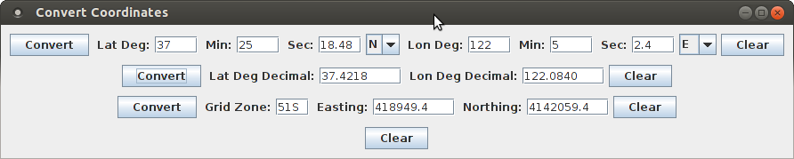

*ConvertCoordinates*
====================

Summary
-------

Converts coordinates between degree-minutes-seconds, decimal, and UTM format

Overview
--------

ConvertCoordinates is a simple, single-window application for converting
coordinates among decimal lat-lon, degree-minute-second lat-lon, and
UTM.

ConvertCoordinates is based on algorithms from a C app by Peter Daly.
A copy of the C app and its acknowledgments are located here:

'./misc/convert_datum.c'.

